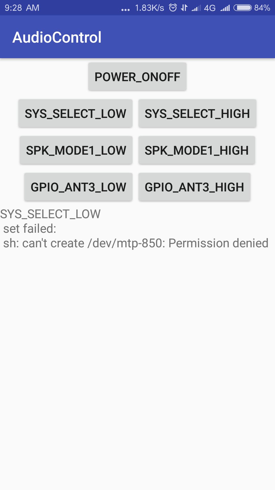

# Audio Control

## Shell Command

```
POWER_ONOFF
echo 1xxx > /dev/mtp-850

SYS_SELECT_LOW
echo x0xx > /dev/mtp-850

SYS_SELECT_HIGH
echo x1xx > /dev/mtp-850

SPK_MODE1_LOW
echo xx0x > /dev/mtp-850

SPK_MODE1_HIGH
echo xx1x > /dev/mtp-850

GPIO_ANT3_LOW
echo xxx0 > /dev/mtp-850

GPIO_ANT3_HIGH
echo xxx1 > /dev/mtp-850
```

## Software Interface


